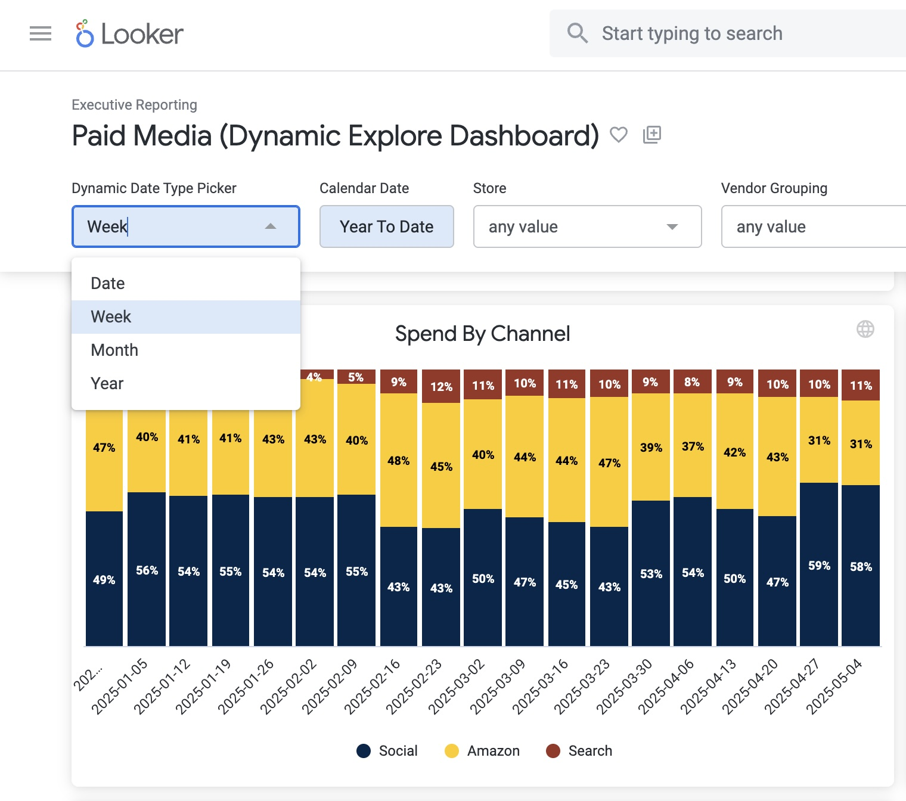

# looker-end-to-end-bi-reporting

This portfolio showcases my work developing scalable, end-to-end business intelligence solutions in Looker. These projects span multiple domains including marketing, sales, executive reporting, subscriptions, and customer retention analytics. The work highlights my skills in LookML modeling, dashboard design, and translating business requirements into actionable insights.

---

## 🧠 Key Capabilities

- ⚙️ Custom LookML Views, Explores, Joins, and Persistent Derived Tables (PDTs)
- 📈 Dynamic dashboards with role-based filtering and time selectors
- 💡 Business logic for metrics such as CAC, ROAS, LTV, and cohort-based retention
- 🚀 Performance tuning for enterprise-scale datasets in BigQuery
- 🔗 Cross-platform integration (GA4, Google Ads, Meta Ads, Shopify, PostgreSQL)

---

## 📊 Project 1: Paid Media Performance Dashboard

**Audience**: Marketing and Acquisition Teams  
**Goal**: Enable paid media managers to self-serve campaign performance insights and reduce time spent on weekly executive reporting.

### 🔍 Features
- Cross-channel filters (Meta, Google Ads, Amazon)
- Campaign and creative-level drill-down
- Dynamic date range selectors (MTD, QTD, Rolling 5 Weeks, etc.)
- KPIs: Spend, Impressions, Clicks, CTR, ROAS, CAC

### 🧩 Technical Highlights
- Custom dimensions to classify campaigns by funnel stage (based on naming conventions or fallback hardcoded rules)
- Scheduled dashboard delivery to stakeholders via email

### 💥 Business Impact
- Eliminated manual weekly reporting for the paid media manager
- Delivered consistent, executive-ready performance summaries with no analyst intervention

### 📸 Screenshot: Paid Media Performance Dashboard

  


### 🧠 Campaign Funnel Classification: `funnel_type` Dimension

To power funnel-stage analysis across paid media campaigns, I created a robust custom dimension in LookML that classifies campaigns as **Upper**, **Mid**, or **Lower Funnel**.

#### 🔧 How It Works:
- Hardcoded list of legacy campaigns for guaranteed accuracy
- Pattern-matching logic for newer campaigns with naming consistency
- Catch-all fallback using keywords (`Awareness`, `Conversion`, etc.)
- All unmatched campaigns are labeled as `Unidentified` to preserve completeness

### 📄 Example LookML Snippet

```lookml
dimension: funnel_type {
  type: string
  label: "Funnel Type"
  description: "Categorizes campaigns into funnel stages based on the campaign name"
  sql:
    CASE
      WHEN ${campaign_name} IN (...) THEN 'Upper'
      WHEN ${campaign_name} IN (...) THEN 'Mid'
      WHEN ${campaign_name} IN (...) THEN 'Lower'
      WHEN ${campaign_name} LIKE 'TNT|Drip Drop|YouTube|Remarketing|%' THEN 'Mid'
      WHEN ${campaign_name} LIKE '%Awareness%' OR ${campaign_name} LIKE '%_UF_%' THEN 'Upper'
      ...
      ELSE 'Unidentified'
    END ;;
}


