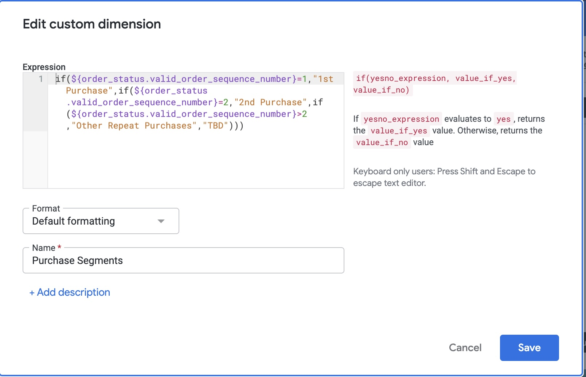
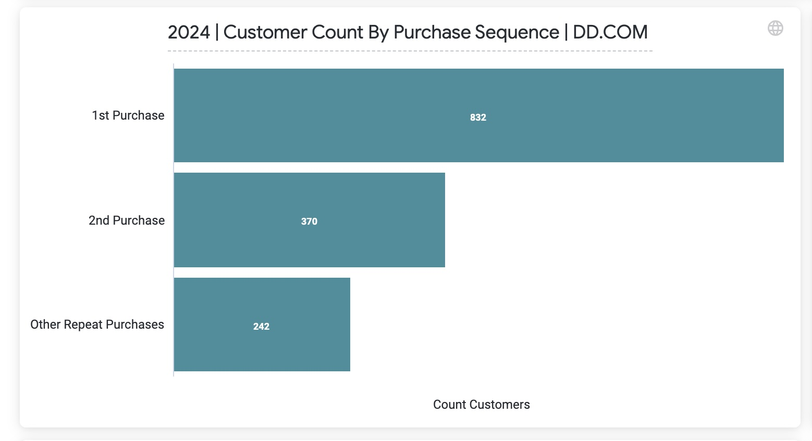

# looker-end-to-end-bi-reporting

This portfolio showcases my work developing scalable, end-to-end business intelligence solutions in Looker. These projects span multiple domains including marketing, sales, executive reporting, subscriptions, and customer retention analytics. The work highlights my skills in LookML modeling, dashboard design, and translating business requirements into actionable insights.

---

## 🧠 Key Capabilities

- ⚙️ Custom LookML Views, Explores, Joins, and Persistent Derived Tables (PDTs)
- 📈 Dynamic dashboards with role-based filtering and time selectors
- 💡 Business logic for metrics such as CAC, ROAS, LTV, and cohort-based retention
- 🚀 Performance tuning for enterprise-scale datasets in BigQuery
- 🔗 Cross-platform integration (GA4, Google Ads, Meta Ads, Shopify, PostgreSQL)

---

## 📊 Project 1: Paid Media Performance Dashboard

**Audience**: Marketing and Acquisition Teams  
**Goal**: Enable paid media managers to self-serve campaign performance insights and reduce time spent on weekly executive reporting.

### 🔍 Features
- Cross-channel filters (Meta, Google Ads, Amazon)
- Campaign and creative-level drill-down
- Dynamic date range selectors (MTD, QTD, Rolling 5 Weeks, etc.)
- KPIs: Spend, Impressions, Clicks, CTR, ROAS, CAC

### 🧩 Technical Highlights
- Custom dimensions to classify campaigns by funnel stage (based on naming conventions or fallback hardcoded rules)
- Scheduled dashboard delivery to stakeholders via email

### 💥 Business Impact
- Eliminated manual weekly reporting for the paid media manager
- Delivered consistent, executive-ready performance summaries with no analyst intervention

### 📸 Screenshot: Paid Media Performance Dashboard

  


### 🧠 Campaign Funnel Classification: `funnel_type` Dimension

To power funnel-stage analysis across paid media campaigns, I created a robust custom dimension in LookML that classifies campaigns as **Upper**, **Mid**, or **Lower Funnel**.

#### 🔧 How It Works:
- Hardcoded list of legacy campaigns for guaranteed accuracy
- Pattern-matching logic for newer campaigns with naming consistency
- Catch-all fallback using keywords (`Awareness`, `Conversion`, etc.)
- All unmatched campaigns are labeled as `Unidentified` to preserve completeness

### 📄 Example LookML Snippet

```lookml
dimension: funnel_type {
  type: string
  label: "Funnel Type"
  description: "Categorizes campaigns into funnel stages based on the campaign name"
  sql:
    CASE
      WHEN ${campaign_name} IN (...) THEN 'Upper'
      WHEN ${campaign_name} IN (...) THEN 'Mid'
      WHEN ${campaign_name} IN (...) THEN 'Lower'
      WHEN ${campaign_name} LIKE 'TNT|Drip Drop|YouTube|Remarketing|%' THEN 'Mid'
      WHEN ${campaign_name} LIKE '%Awareness%' OR ${campaign_name} LIKE '%_UF_%' THEN 'Upper'
      ...
      ELSE 'Unidentified'
    END ;;
}
```


## 📈 Project 2: Executive Pulse Dashboard

**Audience**: C-Level and Executive Leadership  
**Goal**: Provide an automated, high-level pulse on business health covering both short-term and long-term performance.

### 🔍 Features
- Two-part structure: **"Last 12 Months"** and **"Last 5 Weeks"**
- Unique line chart design overlaying:
  - 🟦 Current Year Actuals  
  - 🟨 Previous Year Actuals  
  - 🟥 YoY % Change  
- Metrics: Revenue, Orders, Sessions, CAC, LTV, Retention Rate
- Auto-scheduled delivery to executive inboxes

### 🧩 Technical Highlights
- **YoY calculation** using ISO week matching instead of simple calendar weeks for accuracy
- Custom time-window dimensions to dynamically control report breakdown:
  - `is_last_5_weeks`
  - `is_last_12_months`
  - `is_yoy_comparable`
- Dynamic flagging enabled intuitive dashboard filtering without needing manual parameter controls
- Created a custom LookML view to unify **historical and live spend data** across Amazon, Meta, and other platforms  
  Archived spend data was collected in **Google Sheets**, imported via **Daasity** into Snowflake, and merged with active platform data.  
  This enabled one **master spend dataset** to support full YoY analytics with no data gaps.

### 📄 Master Spend View Snippet

To merge historical and current paid media data, I created a custom view that unified data from Amazon, Meta, and other platforms into a single spend dataset. This ensured executive dashboards could reflect accurate YoY performance, even when legacy data wasn't in our primary systems.

```lookml
view: vendor_performance_plus_historical {
  derived_table: {
    sql:
      SELECT * FROM DAASITY_DB.UMS.VENDOR_PERFORMANCE
      UNION ALL
      SELECT * FROM DAASITY_DB.GSHEETS.DS_AMAZON_HISTORICAL_FINAL
      UNION ALL
      SELECT * FROM DAASITY_DB.AMAZON_DSP_JAN01_2023_TO_DEC31_2024.GSHEETS
      UNION ALL
      SELECT * FROM DAASITY_DB.AMAZON_DSP_JAN01_2025_TO_CURRENT.GSHEETS
      UNION ALL
      SELECT * FROM DAASITY_DB.GOOGLEADS_HISTORICALDATA_JAN01_2023_TO_AUG31_2024.GSHEETS
    ;;
  }

  # Dimension for period (current vs comp)
  dimension: period {
    type: string
    sql: ${calendar_v2.period} ;;
  }

  dimension: id {
    type: string
    sql: ${TABLE}.id ;;
  }

# other dimensions and measures
  END ;;
}
```

### 📸 Screenshot: Executive Pulse Dashboard 


## 🔁 Project 3: Sample Pack Repeat Purchase Funnel

**Audience**: Retail and Merchandising Teams  
**Goal**: Measure the effectiveness of sample pack offers by tracking whether first-time buyers return to make additional purchases.

### 🔍 Features
- Segmented customers based on order count: first-time, second-time, and repeat (3+ purchases)
- Built visual funnel in Looker to show drop-off between first, second, and third+ purchases
- Custom filtering to isolate customers who started with a **specific SKU** (sample pack)
- Allowed granular exploration by date, SKU group, and acquisition source

### 🧩 Technical Highlights
- Created a **custom dimension** using **table expressions in the Looker UI** to classify users by order sequence
- Joined order-level data to customer IDs and used window functions to calculate sequence position
- Used filters to isolate customers whose **first purchase SKU** matched defined sample pack product IDs

### 📄 Valid Order Classification (UI-based)

Used a Looker table calculation + custom dimension to segment customers by valid purchase behavior and order sequence:



### 📊 Sample Pack Conversion Funnel

This visualization tracks the number of customers who made:
- Only their **first purchase** (sample pack)
- Came back for a **second purchase**
- Became **repeat customers** with 3+ orders



### 💥 Business Impact
- Informed merchandising decisions by identifying the **true downstream value of sample pack promotions**
- Enabled the retail team to prioritize which SKUs to feature in acquisition funnels
- Resulted in a shift toward promoting bundles with **higher 2nd-order conversion rates**


