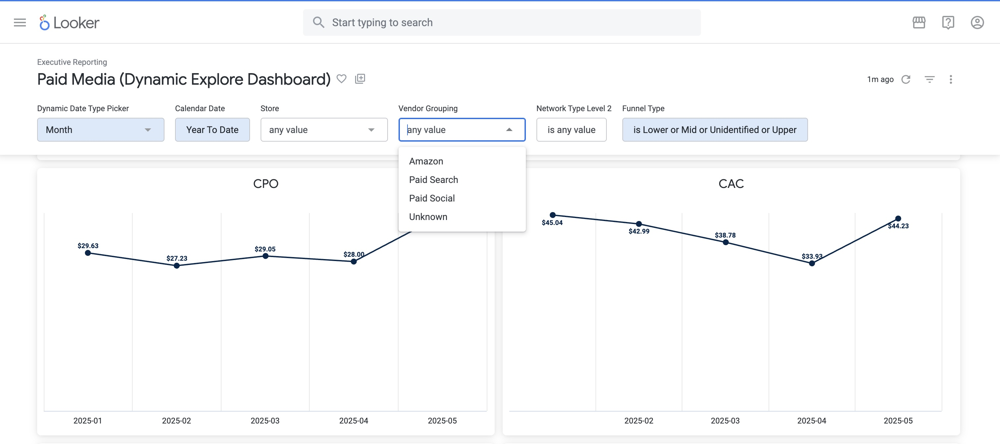

# looker-end-to-end-bi-reporting

This portfolio showcases my work developing scalable, end-to-end business intelligence solutions in Looker. These projects span multiple domains including marketing, sales, executive reporting, subscriptions, and customer retention analytics. The work highlights my skills in LookML modeling, dashboard design, and translating business requirements into actionable insights.

## 🧠 Key Capabilities

- ⚙️ Custom LookML Views, Explores, Joins, and Persistent Derived Tables (PDTs)
- 📈 Dynamic dashboards with role-based filtering and time selectors
- 💡 Business logic for metrics such as CAC, ROAS, LTV, and cohort-based retention
- 🚀 Performance tuning for enterprise-scale datasets in BigQuery
- 🔗 Cross-platform integration (GA4, Google Ads, Meta Ads, Shopify, PostgreSQL)

---

## 📊 Project 1: Paid Media Performance Dashboard

**Audience**: Marketing and Acquisition Teams  
**Goal**: Enable paid media managers to self-serve campaign performance insights and reduce time spent on weekly executive reporting.

### 🔍 Features
- Cross-channel filters (Meta, Google Ads, Amazon)
- Campaign and creative-level drill-down
- Dynamic date range selectors (MTD, QTD, Rolling 5 Weeks, etc.)
- KPIs: Spend, Impressions, Clicks, CTR, ROAS, CAC

### 🧩 Technical Highlights
- Custom dimensions to classify campaigns by funnel stage (based on naming conventions or fallback hardcoded rules)
- Scheduled dashboard delivery to stakeholders via email

### 💥 Business Impact
- Eliminated manual weekly reporting for the paid media manager
- Delivered consistent, executive-ready performance summaries with no analyst intervention

### 📸 Screenshot: Paid Media Performance Dashboard



----


## 📈 Project 2: Executive Pulse Dashboard

**Audience**: C-Level and Executive Leadership  
**Goal**: Provide an automated, high-level pulse on business health covering both short-term and long-term performance.

### 🔍 Features
- Two-part structure: "Last 12 Months" and "Last 5 Weeks"
- Line charts with **three overlaid series**:
  - Current Year Actuals
  - Previous Year Actuals
  - YoY % Change
- Metrics: Revenue, Orders, Sessions, CAC, LTV, Retention Rate

### 🧩 Technical Highlights
- Scheduled weekly email delivery to C-level execs
- YoY logic using ISO week matching (not just calendar weeks)
- Custom dimension flags for:
  - `is_last_5_weeks`
  - `is_last_12_months`
  - `is_yoy_comparable`

### 💥 Business Impact
- Became a weekly staple in exec decision-making
- Improved strategic agility by enabling fast trend detection and performance conversations

---

## 🔬 Advanced LookML Techniques

This section highlights custom LookML solutions I built to solve real-world analytics challenges.

### 🧱 Custom Funnel Type Logic from Campaign Names
- Created a **dimension** `funnel_type` using pattern matching and naming rules.
- When campaign names followed standards (e.g., `top_funnel_*`, `retargeting_*`), used `CASE` logic with `REGEXP_MATCH`.
- For historical campaigns with no naming consistency, used **hardcoded lookup mapping** for reliability.

```lookml
dimension: funnel_type {
  type: string
  sql:
    CASE
      WHEN ${campaign_name} LIKE '%prospecting%' THEN 'Top Funnel'
      WHEN ${campaign_name} LIKE '%retarget%' THEN 'Bottom Funnel'
      WHEN ${campaign_id} IN (123, 456, 789) THEN 'Middle Funnel'
      ELSE 'Unknown'
    END ;;
}

----

## 🗓️ Intelligent Time Comparison Flags

To enable robust Year-over-Year (YoY) and rolling-period comparisons in Looker, I developed custom dimensions to flag specific time frames. These flags allow dashboards and Explores to dynamically filter for relevant periods across years.

### 🔧 Custom LookML Dimensions

```lookml
dimension: is_last_5_weeks {
  type: yesno
  sql: DATE_TRUNC(${event_date}, WEEK(MONDAY)) BETWEEN DATE_TRUNC(DATE_SUB(CURRENT_DATE(), INTERVAL 5 WEEK), WEEK(MONDAY))
       AND DATE_TRUNC(CURRENT_DATE(), WEEK(MONDAY)) ;;
}

dimension: is_yoy_comparable {
  type: yesno
  sql: EXTRACT(ISOYEAR FROM ${event_date}) IN (
           EXTRACT(ISOYEAR FROM CURRENT_DATE()), 
           EXTRACT(ISOYEAR FROM DATE_SUB(CURRENT_DATE(), INTERVAL 1 YEAR))
       ) ;;
}
### ✅ Use Cases and Benefits

These dimensions were critical for building **accurate YoY comparisons** by ISO week and month across different years.

They enabled flexible and reliable filters in Looker dashboards, such as:

- ✅ Show only data from the **last 5 comparable ISO weeks**
- ✅ Compare **this year's performance to last year’s** for the same time frame

These flags were leveraged across multiple dashboards, including:

- 📊 **Executive Pulse**
- 🔁 **Subscription Retention**
- 📈 **Paid Media Trends**

